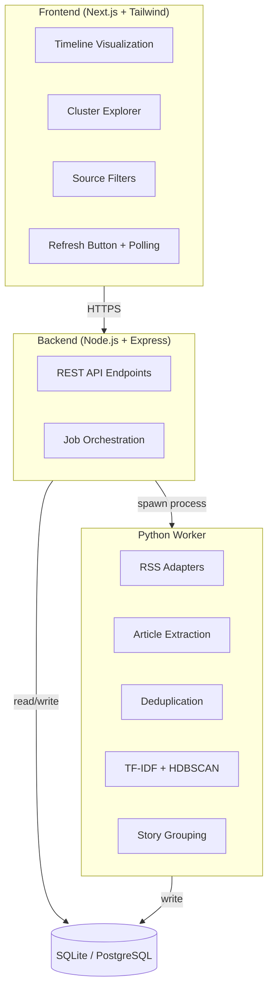

# 📰 News Pulse — Topic-Clustered News Timeline

> A full-stack system that ingests live articles from multiple news RSS feeds, automatically groups related articles into semantic topic clusters using NLP, and displays those clusters as a visually rich timeline.

*Built for the Xponentium India Internship Assessment.*

---

## ✨ Key Features

| Feature | Description |
| :--- | :--- |
| **🌐 Multi-Source Ingestion** | Pulls news from BBC News, NPR, Reuters, Times of India, and The Hindu, normalizing XML structures. |
| **📄 Full-Text Extraction** | Automatically fetches full article body content (with fallbacks) to ensure accurate semantic clustering. |
| **🛡️ Deduplication** | SHA-256 URL hashing prevents identical articles from cluttering the database across multiple ingestions. |
| **🧠 Semantic Clustering** | Uses TF-IDF embeddings and HDBSCAN to discover organic topic clusters (with keyword-based fallback). |
| **📚 Story Grouping** | Merges similar topic clusters to represent broader, ongoing macro news stories. |
| **📈 Timeline Visualization** | Premium React-based frontend plotting topics across time, representing story size by visual intensity. |
| **⚙️ Async Job Polling** | Long-running scraper jobs are executed in the background without blocking the main API. |

---

## 🏗️ Tech Stack & Architecture

| Layer | Technology | Purpose |
| :--- | :--- | :--- |
| **Frontend** | Next.js 14, React, Tailwind CSS | UI, timeline visualization, and client-side polling |
| **Backend API** | Node.js, Express, TypeScript | REST API, job orchestration, database queries |
| **NLP Worker** | Python, `scikit-learn`, `trafilatura` | RSS parsing, text extraction, TF-IDF clustering |
| **Database** | SQLite / PostgreSQL | Robust storage layer easily swappable via `.env` |

### 🗺️ System Diagram



---

## 🛠️ Local Setup & Development

### 1️⃣ Prerequisites
- **Node.js**: v18 or higher
- **Python**: 3.9 or higher
- **Git**

### 2️⃣ Start Both Servers Automatically (Windows)
The easiest way to start the entire system is to use the provided PowerShell script.

```powershell
powershell -ExecutionPolicy Bypass -File .\start.ps1
```
> **Note:** The backend runs on `http://localhost:3001` and the frontend on `http://localhost:3000`.

### 3️⃣ Manual Setup (Alternative)

<details>
<summary>Click here for manual, step-by-step startup instructions</summary>

**Python Scraper Setup**
```bash
cd scraper
python -m venv venv
.\venv\Scripts\activate   # Windows
source venv/bin/activate  # Mac/Linux
pip install -r requirements.txt
```

**Backend Setup**
```bash
cd backend
npm install
npm run dev
```

**Frontend Setup**
```bash
cd frontend
npm install
npm run dev
```

</details>

---

## 📡 API Endpoints

| Method | Endpoint | Description |
| :--- | :--- | :--- |
| `GET` | `/clusters` | List all topic clusters |
| `GET` | `/clusters/:id` | Get cluster detail along with its associated articles |
| `GET` | `/timeline` | Get formatted cluster data optimized for timeline plotting |
| `POST` | `/ingest/trigger` | Trigger the scraping + clustering background pipeline |
| `GET` | `/ingest/status/:jobId` | Check the status of a specific pipeline job |

---

## 🧠 Clustering Approach Explained

### Why TF-IDF + HDBSCAN?
This system utilizes a combination of **TF-IDF Vectorization** and **HDBSCAN Clustering** (Option B from the assessment), with a robust keyword-overlap fallback mechanism.

1. **TF-IDF**: Extracts text features from the title, summary, and first 500 characters of the article body, effectively filtering out generic stop words.
2. **HDBSCAN vs KMeans**: We chose HDBSCAN because in real-world news, we do not know the exact number of topics (*k*) beforehand. Some clusters (major breaking news) are highly dense while others are sparse. HDBSCAN dynamically discovers clusters based on density and gracefully handles noise.
3. **Automatic Label Generation**: Cluster labels are generated automatically by extracting the top 3 highest TF-IDF scoring terms within that cluster's centroid vector.

> [!TIP]
> **Limitations & Future Improvements:** Pulling full article bodies synchronously over the network adds latency. For a true production environment, this should ideally be parallelized with asynchronous distributed workers (e.g., Celery or BullMQ). Multilingual support would also require language detection and specialized tokenizers.

---

## 🚀 Deployment Guide

| Component | Platform | Instructions |
| :--- | :--- | :--- |
| **Database** | Neon.tech | Create a free PostgreSQL instance on [Neon](https://neon.tech) and copy your connection string (`postgres://...`). |
| **Backend** | Render | Create a Web Service pointing to the `backend` folder. Build: `npm install && npm run build`. Start: `npm start`. Add `DATABASE_URL` and `PYTHON_PATH` to environment variables. |
| **Frontend** | Vercel | Import the repo to Vercel, select the Next.js preset for the `frontend` directory, and set `NEXT_PUBLIC_API_URL` to your Render backend URL. |

---

## 📹 Video Walkthrough
*(Link to the 2-3 minute unlisted Loom/YouTube video goes here)*
